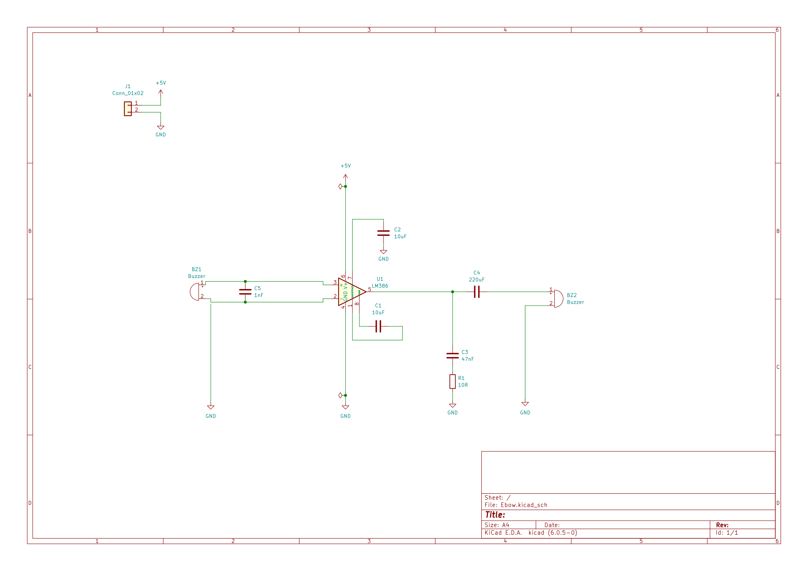

### Schematic

### Layout

Note: there are two required patch wires for U1 (opamp):

- U1 Pin2 to GND: The GND connection can be soldered anywhere to the bottom left ground plane on the top layer.
- U1 Pin6 to J1 Pin1 (5V): The J1 pins are on the opposite side of the board so the patch wire will need to go off the board edge to reach J1 Pin1.

#### Top copper islands

#### Bottom copper islands

