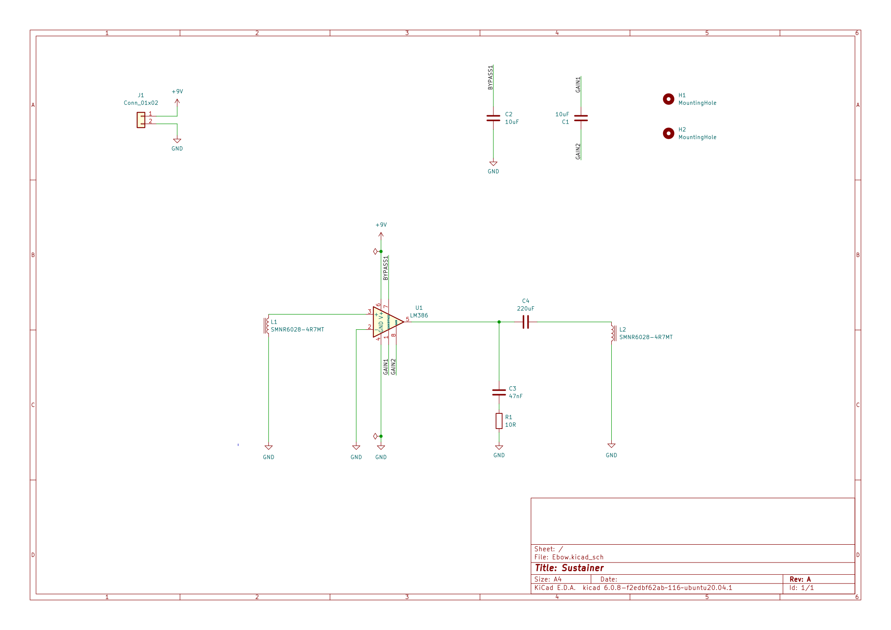
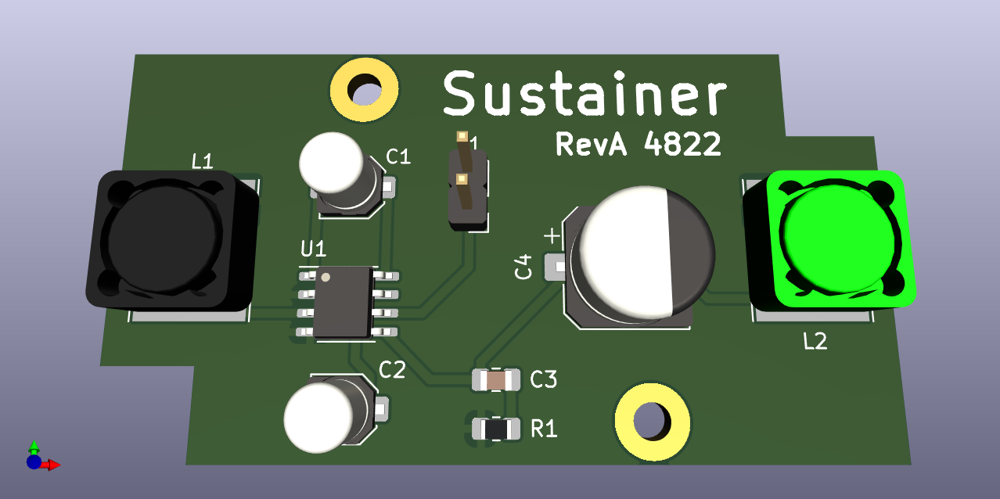

- Designed to use SMT parts
- Uses [LM386](datasheets/lm386.pdf) op amp.
- Use ferrite core, wound inductors for input/output coils (`L1/L2`). See [datasheet](datasheets/2108131830_SXN-Shun-Xiang-Nuo-Elec-SMNR6028-4R7MT_C266428.pdf) for example part.
- Small magnetic should be superglued to the top of each buzzer
- Power connector `J1` should be wired to 9v battery. Observer correct polarity when wiring battery connector.
- PCB fits in Hammond 1551H enclosure. See [datasheet](datasheets/1551H.pdf) for details.

