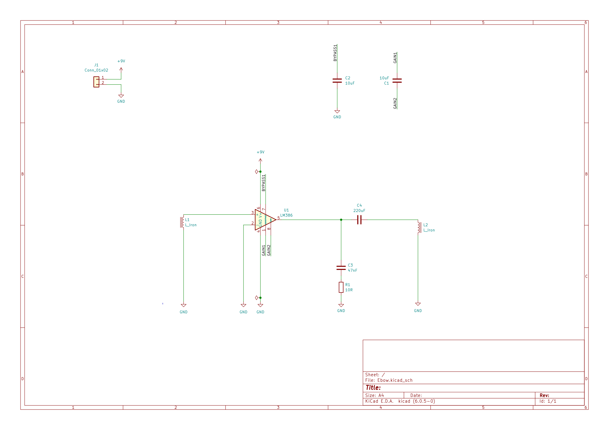

- Designed to use THT parts. 
- Uses [LM386](datasheets/lm386.pdf) op amp.
- Uses a buzzer for the input/output coils (`L1/L2`).
- Small magnetic should be superglued to the top of each buzzer
- Power connector `J1` should be wired to 9v battery. Observer correct polarity when wiring battery connector.
- PCB fits in Hammond 1551H enclosure. See [datasheet](datasheets/1551H.pdf) for details.

